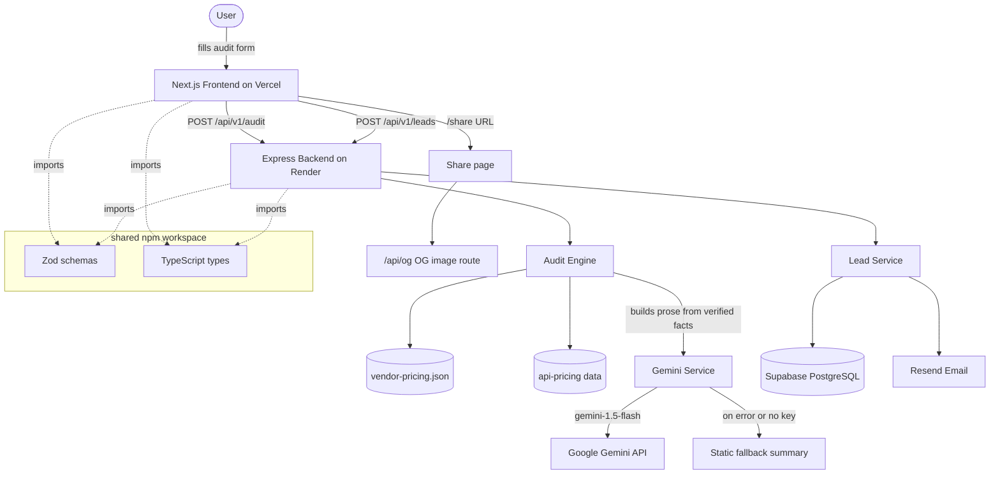
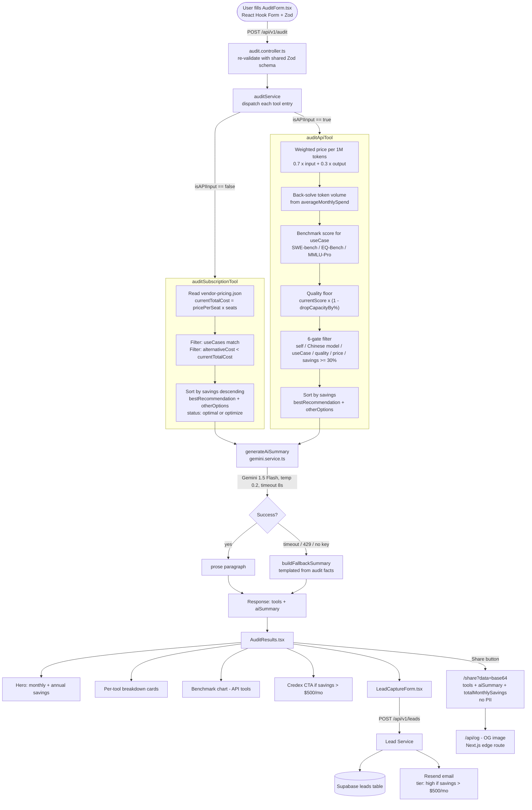

# Architecture — SpendSmart

## System Diagram



## Data Flow: Input to Audit Result



## Audit Engine — Full Reasoning

### Why hardcoded rules, not an LLM

The audit math must be traceable. Every savings figure needs to link back to a vendor pricing page URL and a verified date. LLM-generated numbers cannot be cited. A rule engine reading from `vendor-pricing.json` (with verified dates, source URLs per entry) can be audited line by line by a finance person. The AI runs once, after the math is done, to convert already-verified facts into readable prose. Knowing when not to use AI is part of the design.

---

### Subscription audit logic

For a given tool and plan, the cost is:

```
currentTotalCost = pricePerSeat × seats
```

If `pricePerSeat` is not in the pricing data (enterprise plans), `monthlySpend` from user input is used directly.

For every alternative plan across all vendors, the engine checks:

1. `plan.useCases` includes the user's declared `useCase`
2. `alternativeCost = plan.pricePerSeat × seats < currentTotalCost`

Candidates are sorted by absolute savings. The top result is `bestRecommendation`.

**Why `useCases` lives at plan level, not tool level**

Early draft tagged `useCases` on the vendor object. That was wrong — Gemini Plus has no CLI or IDE integration. Tagging the whole Gemini vendor as supporting coding would cause the engine to recommend Gemini Plus to a developer. `useCases` belongs on each plan entry so the filter is applied at the level where it is actually meaningful.

**Why `mixed` use case instead of per-task rows**

If a user adds Claude Pro three times — once for writing, coding, research — and the engine evaluates each row independently, it would compute savings per use case and sum them. But they are paying one $20 subscription. Following that advice and splitting across three cheaper tools could cost more. The fix: one row per subscription, `mixed` use case if it covers multiple tasks. One record, one cost, honest savings.

---

### API audit logic — the constrained optimization

API usage is not a pricing problem. It is a capability problem that also involves pricing. A user on Claude Opus 4.7 did not pick it randomly. Recommending the cheapest available model without checking whether it can do the job is noise.

The problem is formally:

$$\text{Minimize} \quad \text{Cost}(m)$$

$$\text{subject to} \quad \text{Capability}(m) \geq \text{Required Capability}$$

where $m$ is a candidate model and Capability comes from benchmark data.

---

#### Weighted token price

API costs depend on both input and output token prices, which differ per model. Real workloads skew input-heavy (prompts are usually longer than completions). A fixed 70/30 assumption is used:

$$p_{\text{weighted}} = 0.7 \times p_{\text{input}} + 0.3 \times p_{\text{output}}$$

where prices are per 1M tokens.

---

#### Estimating monthly token volume from spend

Users know their monthly bill. They do not know their token counts. The engine back-solves:

$$\text{estimatedMonthlyTokens} = \frac{\text{averageMonthlySpend}}{p_{\text{weighted}}} \times 1{,}000{,}000$$

This is then used to estimate what the same workload would cost on a different model:

$$\text{estimatedNewSpend} = \frac{\text{estimatedMonthlyTokens}}{1{,}000{,}000} \times p_{\text{weighted, candidate}}$$

$$\text{monthlySavings} = \text{averageMonthlySpend} - \text{estimatedNewSpend}$$

The 70/30 ratio is a practical default. It is directionally correct for most workloads. Known edge cases: coding agents generate large outputs (skews output-heavy); retrieval pipelines have massive inputs (skews input-heavy); reasoning models have hidden chain-of-thought tokens. No per-request ratio field is exposed in the schema — the assumption is accepted as a limitation.

---

#### Benchmark scoring

The use case determines which benchmark is used:

$$\text{useCase} \rightarrow \text{benchmark} \rightarrow \text{score}$$

| Use case | Benchmark |
|---|---|
| coding | SWE-bench Verified |
| writing | EQ-Bench |
| research, data | MMLU-Pro |

Scores are compared in raw units within the same benchmark. Because `useCase → benchmark` is a 1:1 mapping, a candidate is always evaluated against the current model on the same scale — an Elo score is never placed next to a percentage. No cross-scale normalization is needed or performed.

---

#### Quality floor

The system never decides what "good enough" means. That is the user's call. The user provides `dropCapacityBy` (default 5%). The engine computes:

$$\text{minAcceptableScore} = \text{currentScore} \times \left(1 - \frac{\text{dropCapacityBy}}{100}\right)$$

A candidate must satisfy `candidateScore >= minAcceptableScore` to pass the quality gate.

---

#### The 6-gate filter

Each candidate model passes through six gates in order:

| Gate | Check |
|---|---|
| 0 | Skip self (same vendor + same model) |
| 1 | Skip Chinese models if `okayWithChineseModals == false` |
| 2 | Candidate supports the use case |
| 3 | Candidate score ≥ quality floor |
| 4 | Candidate weighted price < current weighted price |
| 5 | `savingsPct = (monthlySavings / averageMonthlySpend) × 100` ≥ 30% |
| 6 | Candidate context window ≥ required (only checked when caller specifies) |

Gate 5 exists because a marginal cost saving surfaces as a recommendation but gives the user almost no ROI. The 30% threshold filters those out and keeps the output actionable. Gate 6 is optional — most audits do not specify a context window requirement.

Candidates that clear all gates are sorted by `monthlySavings` descending. The top result is `bestRecommendation`. The rest are `otherOptions`.

---

### Known limitations in the math

1. **70/30 token ratio** — a static assumption. Wrong for output-heavy (agentic) or input-heavy (RAG) workloads, and incorrect for reasoning models with hidden tokens. Accepted because token counts are not available at audit time.

2. **Same-benchmark-only comparison** — scores are only compared within the same benchmark. If a future use case required recommending across benchmarks (e.g., ranking a coding model against a writing model), raw scores would be incomparable and normalization would be required. The current `useCase → benchmark` 1:1 mapping avoids this entirely, but it also means the engine cannot surface cross-domain tradeoffs.

3. **Subscription cost = pricePerSeat × seats** — does not account for annual discounts, custom enterprise pricing, or bundled features. For plans with unknown pricing, `monthlySpend` from user input is used directly.

4. **Base64 share URLs** — encoding the full audit result in the URL avoids a database write per share and keeps PII separation clean (email never enters the URL). The tradeoff is URL length: a user with 8+ tools and full API audit data approaches browser URL length limits (~2000 chars). At scale, the fix is a short-ID share table: store the audit JSON server-side and issue a 6-char slug. Not implemented in MVP.

---

## Stack

| Layer | Choice | Reason |
|---|---|---|
| Frontend | Next.js 15 + React 19 | App Router for OG image routes; SSR for share pages; Vercel free tier |
| Styling | Tailwind CSS 4 + shadcn/ui | Fast iteration; headless primitives; no pre-built template |
| Forms | React Hook Form + Zod | Validation co-located with the shared backend schema |
| Backend | Express 5 + TypeScript | Minimal surface area; better async error handling in v5 |
| ORM | Drizzle + pg | Type-safe SQL; schema is simple enough that a heavy ORM adds nothing |
| Database | Supabase (PostgreSQL) | Managed Postgres; free tier is sufficient; familiar tooling |
| Email | Resend | Best developer experience for transactional email at this scale |
| AI summary | Gemini 1.5 Flash | See note below — Anthropic is preferred per spec; Gemini chosen for cost |
| Monorepo | npm workspaces (`shared/`) | Single source of truth for Zod schemas and types used by both packages |
| CI | GitHub Actions | Lint + test on push to `main`; Render deploy on `deploy/prod` |

TypeScript strict mode is enabled across all three packages.

---

## Why Gemini, not Anthropic API

The assignment specifies the Anthropic API as the preferred provider for the AI summary. Gemini 1.5 Flash was chosen instead for one practical reason: cost at the free tier.

The summary is a single ~100-word paragraph generated from already-verified facts — the audit output is the source of truth, not the model. For this task, the difference in prose quality between Gemini 1.5 Flash and Claude Haiku is not meaningful to the end user. Gemini 1.5 Flash's free tier offers 1,500 requests per day with a 1M token context window. That is enough to run every audit on the deployed app without paying anything until real traction exists. Anthropic's free tier is significantly lower volume.

The fallback is deterministic: if the Gemini call fails (timeout, 429, missing key), `buildFallbackSummary()` produces a templated summary from the same audit facts. The AI path is a polish layer, not a load-bearing component. Swapping to Anthropic would be a two-line change in `gemini.service.ts` — the abstraction exists specifically so that the provider can change without touching anything else.

---

## Why Express, not Next.js API routes

The audit engine loads `vendor-pricing.json` and the API pricing data at startup and holds them in memory. The DB connection pool and rate limiter instances are also persistent. Next.js API routes on Vercel's edge runtime are stateless per invocation — pricing data would be re-read on every request, and rate limiter state would not survive across cold starts. An Express process on Render persists all of this in memory. The cost is a second deployment target; the benefit is a predictable, stateful server.

---

## What would change at 10k audits/day

**1. Rate limiting** — `express-rate-limit` stores counters in process memory. Multiple Render instances would each have separate counters, making the limit effectively per-instance. Replace with Redis-backed rate limiting (Upstash + `rate-limiter-flexible`).

**2. AI summary queue** — at volume, Gemini API calls block the response. Move summary generation to an async queue (BullMQ or Inngest). The audit result is returned immediately; the AI summary is delivered via a polling endpoint or WebSocket when ready.

**3. Pricing data** — `vendor-pricing.json` is loaded at startup from the filesystem. At scale, stale prices are a trust problem. A weekly cron job that validates prices against vendor pages and pushes a config update would keep data current without a redeploy.

**4. Caching** — the audit engine is deterministic for identical inputs. A Redis cache keyed on a hash of the request body would skip computation and Gemini calls for repeated queries (e.g. viral share link traffic retrying the same inputs).

**5. Database** — the `leads` table is append-only and currently low-volume. At 10k audits/day, add an index on `email` (already unique-constrained) and a read replica for analytics queries without touching write performance.

**6. Share page** — `/share` responses are already edge-compatible. Vercel edge caching on the share route absorbs traffic spikes from viral shares without hitting the backend.
